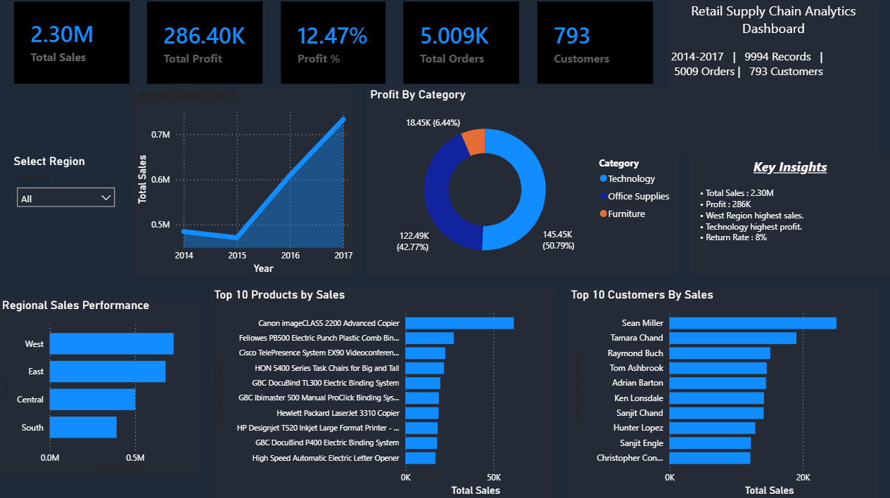

# Retail Supply Chain Analytics Dashboard

## 📌 Project Overview

This project presents an end-to-end Retail Supply Chain Analytics Dashboard built using Python (Pandas), Power BI, and DAX. The dashboard analyzes sales, profitability, customer behavior, and regional performance to generate actionable business insights.

---

## 🛠️ Tools & Technologies

- Python
- Pandas
- Microsoft Excel
- Power BI
- DAX

---

## 📊 Dataset Information

- Records: 9,994
- Orders: 5,009
- Customers: 793
- Time Period: 2014–2017

---

## 📈 Dashboard Features

- Total Sales KPI
- Total Profit KPI
- Profit Margin
- Total Orders
- Total Customers
- Annual Sales Trend
- Profit by Category
- Regional Sales Performance
- Top 10 Products by Sales
- Top 10 Customers by Sales
- Region Filter
- Business Insights

---

## 💡 Key Insights

- Total Sales: **2.30M**
- Total Profit: **286K**
- Profit Margin: **12.47%**
- West region generated the highest sales.
- Technology category generated the highest profit.
- Return Rate: **8%**

---

## 🖼️ Dashboard Preview



---

## 📂 Repository Structure

```
Retail-Supply-Chain-Analytics/
│
├── project.py
├── Retail Dashboard.pbix
├── dashboard.png
├── Retail-Supply-Chain-Sales-Dataset.xlsx
└── README.md
```

---

## 🚀 Skills Demonstrated

- Data Cleaning
- Exploratory Data Analysis (EDA)
- Data Visualization
- KPI Design
- DAX Measures
- Business Intelligence
- Dashboard Development
